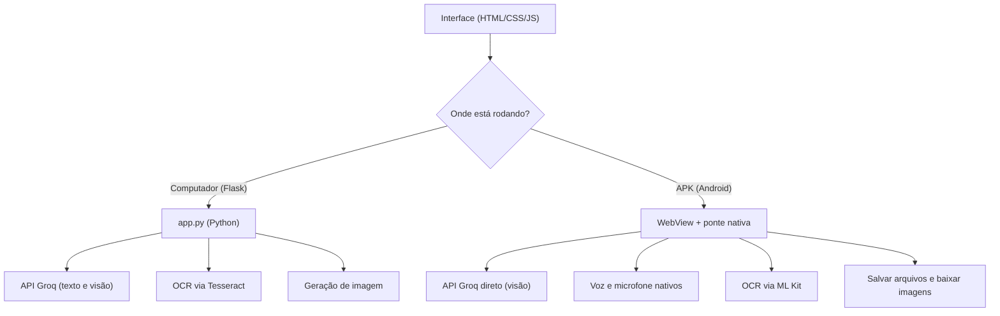

# YuIA

YuIA é um assistente de IA no estilo ChatGPT, com tema escuro (preto e azul). Ele foi feito com Python (Flask) e Groq. Funciona no computador e também vira um aplicativo (APK) para Android. A mesma interface serve para os dois.

## O que ele faz

- Conversa por texto (envie com Enter ou no botão de enviar).
- Lê imagens de forma inteligente: usa um modelo de visão da Groq para entender a imagem. Se não der, usa o OCR (Tesseract no computador, ML Kit no APK) como apoio.
- Gera imagens: use o botão de paleta para criar uma imagem a partir do texto digitado. O YuIA pesquisa na web por referências do assunto para gerar imagens mais fiéis (ex.: um personagem de anime fica parecido com o personagem real).
- Pesquisa na web sempre ativa: a cada pergunta o YuIA busca informações atuais na internet (via DuckDuckGo, de graça e sem chave, no computador e no APK) e usa o que for relevante na resposta.
- Sabe a data e a hora atuais e informa corretamente quando perguntado.
- Cria e baixa arquivos: quando a IA escreve código, CSV, JSON, HTML e outros, cada trecho ganha um botão "Baixar". Toda resposta pode ser baixada como arquivo .md ou copiada.
- Narra as respostas em voz alta, usando a voz do aparelho, e mostra o texto enquanto fala.
- Escuta pelo microfone (ditado por voz).
- As respostas aparecem aos poucos (streaming), no mesmo ritmo da narração.
- Tem escolha de voz, velocidade da narração, botão "Novo chat" e sugestões de conversa.

## Como funciona



- No computador: o servidor Flask guarda a chave da API e gera as imagens.
- No APK: o WebView carrega a mesma interface, e o app usa recursos nativos do Android (voz, microfone, leitura de imagem, salvar arquivos e baixar imagens). A chave da API entra no APK na hora de compilar, pelo secret do GitHub, e nunca fica no código-fonte.

## Estrutura do projeto

```
.
├── app.py                     # Servidor Flask (modo computador)
├── requirements.txt           # Dependências Python
├── .env.example               # Modelo do arquivo .env
├── templates/index.html       # Interface (compartilhada)
├── static/css/style.css       # Tema preto e azul (compartilhado)
├── static/js/app.js           # Lógica da interface (compartilhada)
├── static/js/marked.min.js    # Markdown (local, funciona offline no APK)
├── android/                   # Projeto Android (WebView + ponte nativa)
│   ├── app/src/main/java/.../MainActivity.java
│   └── build.gradle           # Copia a interface e injeta a chave
└── .github/workflows/build-apk.yml  # Gera o APK na aba Actions
```

> Correção importante: os arquivos usam caminhos relativos (css/, js/). Assim a mesma interface funciona no Flask e no WebView do APK. Antes, os caminhos absolutos (/static/...) quebravam o APK (sem estilo e sem JavaScript).

## Como rodar no computador

Você precisa de: Python 3.10+, uma chave da Groq e o Tesseract.

```bash
# 1. Copie o .env e coloque sua chave
cp .env.example .env
# edite o .env e cole sua GROQ_API_KEY

# 2. Instale as dependências
pip install --break-system-packages -r requirements.txt

# 3. Instale o Tesseract (para ler imagens)
#   Windows: https://github.com/UB-Mannheim/tesseract/wiki (adicione ao PATH)
#   Linux:   sudo apt install tesseract-ocr tesseract-ocr-por
#   macOS:   brew install tesseract tesseract-lang

# 4. Rode
python3 app.py
```

Acesse `http://localhost:5000`. Use o Chrome (Android ou computador) para voz e narração.

## Como gerar o APK

### Pela aba Actions (recomendado)

1. No repositório, vá em Settings, depois em Secrets and variables e Actions, e adicione os secrets:
   - GROQ_API_KEY: sua chave da Groq (obrigatória).
   - GROQ_MODEL: modelo de texto (opcional).
   - GROQ_VISION_MODEL: modelo de visão para imagens (opcional).
   - IMAGE_API_URL: serviço de geração de imagem (opcional).
2. Abra a aba Actions, clique em Build APK e em Run workflow (ou faça um push; o build roda sozinho).
3. Quando terminar, baixe o artefato ia-assistente-apk e instale o app-debug.apk no celular Android.

> O APK guarda a chave da API dentro dele. Por isso, deixe o repositório privado ou troque a chave se o projeto ficar público.

### Localmente (Android Studio ou linha de comando)

```bash
cd android
GROQ_API_KEY=suachave ./gradlew assembleDebug
# APK em: android/app/build/outputs/apk/debug/app-debug.apk
```

## Variáveis de ambiente

| Variável | Descrição | Padrão |
|---|---|---|
| GROQ_API_KEY | Chave de API da Groq (obrigatória) | — |
| GROQ_MODEL | Modelo de texto usado nas respostas | openai/gpt-oss-120b |
| GROQ_VISION_MODEL | Modelo de visão para ler imagens (use none para desligar) | qwen/qwen3.6-27b |
| IMAGE_API_URL | Endereço do serviço de geração de imagens | https://image.pollinations.ai/prompt/ |
| OCR_LANG | Idiomas do Tesseract (modo computador) | por+eng |
| PORT | Porta do servidor Flask | 5000 |

## Observações

- Voz e ditado usam os recursos do aparelho (Web Speech API no navegador; TTS e RecognizerIntent no Android).
- Arquivos: no APK, os arquivos vão para Downloads/IAAssistente (Android 10+) e as imagens geradas vão para Downloads. No computador, o navegador baixa normalmente.
- O arquivo .env tem sua chave secreta e não deve ir para o repositório (já está no .gitignore).
- A interface é a mesma nos dois ambientes: static/js/app.js descobre se está no APK (window.AndroidBridge) ou no navegador.
