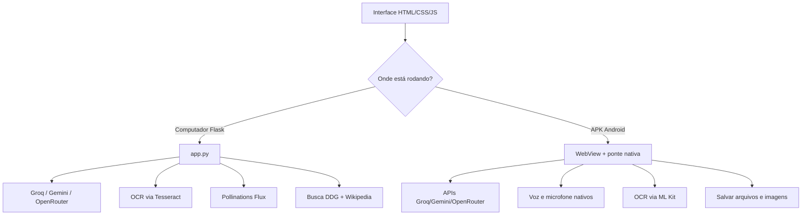

# YuIA

YuIA é um assistente de IA no estilo ChatGPT, com tema escuro (preto e azul). Ele foi feito com Python (Flask) e vários provedores gratuitos (Groq, Gemini e OpenRouter). Funciona no computador e também vira um aplicativo (APK) para Android. A mesma interface serve para os dois.

## O que ele faz

- Conversa por texto (envie com Enter ou no botão de enviar).
- Troca de provedor na interface: Auto, Groq, Gemini e OpenRouter (o Auto tenta o próximo se um falhar).
- Lê imagens de forma inteligente: usa um modelo de visão (Groq ou Gemini) para entender a imagem. Se não der, usa o OCR (Tesseract no computador, ML Kit no APK) como apoio.
- Gera imagens: use o botão de paleta ou peça "gere uma imagem de ...". O prompt é refinado com o modelo de texto e a imagem sai pelo Pollinations (Flux), de graça e sem chave.
- Pesquisa na web: DuckDuckGo (biblioteca, API instantânea e versão lite) com fallback para a Wikipédia em pt/en, no computador e no APK.
- Sabe a data e a hora atuais e informa corretamente quando perguntado.
- Cria e baixa arquivos: quando a IA escreve código, CSV, JSON, HTML e outros, cada trecho ganha um botão "Baixar". Toda resposta pode ser baixada como arquivo .md ou copiada.
- Narra as respostas em voz alta, usando a voz do aparelho, e mostra o texto enquanto fala.
- Escuta pelo microfone (ditado por voz).
- As respostas aparecem aos poucos (streaming), no mesmo ritmo da narração.
- Tem escolha de voz, velocidade da narração, botão "Novo chat" e sugestões de conversa.

## Como funciona



- No computador: o servidor Flask guarda as chaves e gera as imagens.
- No APK: o WebView carrega a mesma interface, e o app usa recursos nativos do Android. As chaves entram no APK na hora de compilar, pelos secrets do GitHub, e nunca ficam no código-fonte.

## Estrutura do projeto

```
.
├── app.py                     # Servidor Flask (modo computador)
├── requirements.txt           # Dependências Python
├── .env.example               # Modelo do arquivo .env
├── templates/index.html       # Interface (compartilhada)
├── static/css/style.css       # Tema preto e azul (compartilhado)
├── static/js/app.js           # Lógica da interface (compartilhada)
├── static/js/marked.min.js    # Markdown (local, funciona offline no APK)
├── android/                   # Projeto Android (WebView + ponte nativa)
│   ├── app/src/main/java/.../MainActivity.java
│   └── build.gradle           # Copia a interface e injeta as chaves
└── .github/workflows/build-apk.yml  # Gera o APK na aba Actions
```

## Como rodar no computador

Você precisa de: Python 3.10+, pelo menos uma chave (Groq e/ou Gemini) e o Tesseract.

```bash
# Copie o .env e coloque suas chaves
cp .env.example .env

# Instale as dependências
pip install --break-system-packages -r requirements.txt

# Instale o Tesseract (para ler imagens)
#   Windows: https://github.com/UB-Mannheim/tesseract/wiki (adicione ao PATH)
#   Linux:   sudo apt install tesseract-ocr tesseract-ocr-por
#   macOS:   brew install tesseract tesseract-lang

# Rode
python3 app.py
```

Acesse `http://localhost:5000`. Use o Chrome (Android ou computador) para voz e narração.

Chaves gratuitas:

- Groq: https://console.groq.com/keys
- Gemini: https://aistudio.google.com/apikey
- OpenRouter (opcional, modelos :free): https://openrouter.ai/keys
- Imagens: Pollinations não precisa de chave

## Como gerar o APK

### Pela aba Actions (recomendado)

1. No repositório, vá em Settings, depois em Secrets and variables e Actions, e adicione os secrets:
   - GROQ_API_KEY: chave da Groq (recomendada).
   - GEMINI_API_KEY: chave do Gemini (recomendada como segundo provedor).
   - OPENROUTER_API_KEY: opcional.
   - GROQ_MODEL, GROQ_VISION_MODEL, GEMINI_MODEL, OPENROUTER_MODEL, IMAGE_API_URL, IMAGE_MODEL: opcionais.
2. Abra a aba Actions, clique em Build APK e em Run workflow (ou faça um push; o build roda sozinho).
3. Quando terminar, baixe o artefato ia-assistente-apk e instale o app-debug.apk no celular Android.

> O APK guarda as chaves dentro dele. Por isso, deixe o repositório privado ou troque as chaves se o projeto ficar público.

### Localmente (Android Studio ou linha de comando)

```bash
cd android
GROQ_API_KEY=suachave GEMINI_API_KEY=suachave ./gradlew assembleDebug
```

APK em: android/app/build/outputs/apk/debug/app-debug.apk

## Variáveis de ambiente

| Variável | Descrição | Padrão |
|---|---|---|
| GROQ_API_KEY | Chave de API da Groq | — |
| GEMINI_API_KEY | Chave de API do Gemini | — |
| OPENROUTER_API_KEY | Chave de API do OpenRouter (opcional) | — |
| LLM_PROVIDER | Provedor padrão: auto, groq, gemini, openrouter | auto |
| GROQ_MODEL | Modelo de texto da Groq | openai/gpt-oss-120b |
| GROQ_VISION_MODEL | Modelo de visão da Groq (none para desligar) | qwen/qwen3.6-27b |
| GEMINI_MODEL | Modelo Gemini | gemini-2.0-flash |
| OPENROUTER_MODEL | Modelo OpenRouter | meta-llama/llama-3.3-70b-instruct:free |
| IMAGE_API_URL | Serviço de geração de imagens | https://image.pollinations.ai/prompt/ |
| IMAGE_MODEL | Modelo Pollinations | flux |
| OCR_LANG | Idiomas do Tesseract (modo computador) | por+eng |
| PORT | Porta do servidor Flask | 5000 |

## Observações

- Voz e ditado usam os recursos do aparelho (Web Speech API no navegador; TTS e RecognizerIntent no Android).
- Arquivos: no APK, os arquivos e imagens vão para Downloads/IAAssistente (Android 10+). No computador, o navegador baixa normalmente.
- O arquivo .env tem suas chaves secretas e não deve ir para o repositório (já está no .gitignore).
- A interface é a mesma nos dois ambientes: static/js/app.js descobre se está no APK (window.AndroidBridge) ou no navegador.
