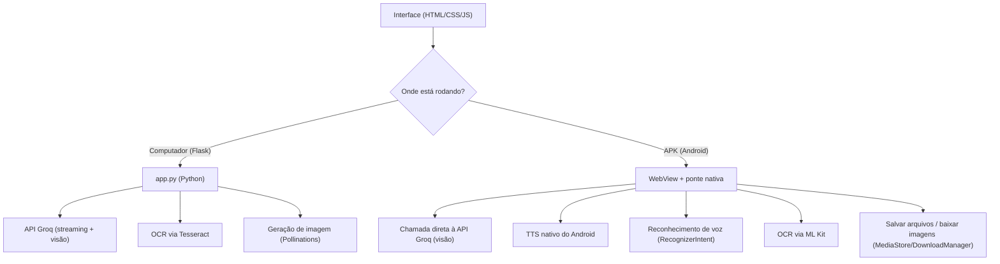

# IA Assistente

Assistente de IA com interface no estilo **ChatGPT**, tema **preto e azul**, construído em **Python (Flask) + Groq**, que roda no computador e também vira um **APK Android** — o mesmo código de interface serve para as duas plataformas.

## Funcionalidades

- Campo de digitação de texto (envio por Enter ou botão).
- **Leitura de imagem inteligente**: usa um **modelo de visão** (Groq Vision) para entender a imagem diretamente; o OCR (Tesseract no computador / ML Kit no APK) fica como contexto auxiliar e plano B.
- **Geração de imagens**: peça para criar uma imagem (botão de paleta) — a IA gera via [Pollinations](https://pollinations.ai), sem chave extra.
- **Criação e download de arquivos**: quando a IA escreve código, CSV, JSON, HTML etc., cada bloco ganha um botão **"Baixar .ext"**; toda resposta pode ser baixada como `.md` ou copiada.
- **Assistente de voz**:
  - Ditado por microfone (Web Speech API no navegador; `RecognizerIntent` no APK).
  - **Narração das respostas com a voz nativa do aparelho** (TTS), mostrando o texto enquanto narra.
- Respostas em **streaming** (aparecem token por token, sincronizadas com a narração).
- Seletor de voz, velocidade da narração e botão "Narrar" para reler qualquer resposta (e parar a narração).
- Atalhos de sugestão e botão "Novo chat".

## Como funciona



- **No computador**: o servidor Flask (`app.py`) mantém a chave da API no servidor, faz o OCR com Tesseract e gera imagens via Pollinations.
- **No APK**: o WebView carrega os mesmos arquivos de interface (`templates/` e `static/`), e uma ponte Java (`MainActivity`) oferece TTS, microfone, OCR, salvamento de arquivos e download de imagens nativos. A chave da API é injetada no APK **em tempo de build** via secret do GitHub — nunca fica no código-fonte.

## Estrutura

```
.
├── app.py                     # Backend Flask (modo computador)
├── requirements.txt           # Dependências Python
├── .env.example               # Modelo do arquivo .env
├── templates/index.html       # Interface (compartilhada)
├── static/css/style.css       # Tema preto e azul (compartilhado)
├── static/js/app.js           # Lógica do frontend (compartilhada)
├── static/js/marked.min.js    # Markdown (local, funciona offline no APK)
├── android/                   # Projeto Android (WebView + ponte nativa)
│   ├── app/src/main/java/.../MainActivity.java
│   └── build.gradle           # Copia o frontend compartilhado e injeta a chave
└── .github/workflows/build-apk.yml  # Gera o APK na aba Actions
```

> **Correção importante:** os assets usam **caminhos relativos** (`css/`, `js/`). Isso faz a mesma interface funcionar no Flask (`/`) e no WebView do APK (`file:///android_asset/`). Antes, os caminhos absolutos `/static/...` quebravam o APK (sem CSS e sem JavaScript).

## Como rodar no computador

Requisitos: Python 3.10+, uma chave da [Groq](https://console.groq.com/keys) e o Tesseract.

```bash
# 1. Crie o arquivo .env com sua chave
cp .env.example .env
# edite o .env e cole sua GROQ_API_KEY

# 2. Instale as dependências
pip install --break-system-packages -r requirements.txt

# 3. Instale o Tesseract (para o leitor de imagem)
#   Windows: https://github.com/UB-Mannheim/tesseract/wiki (adicione ao PATH)
#   Linux:   sudo apt install tesseract-ocr tesseract-ocr-por
#   macOS:   brew install tesseract tesseract-lang

# 4. Rode
python3 app.py
```

Acesse `http://localhost:5000`. Use o **Chrome** (Android ou desktop) para voz e narração.

## Como gerar o APK

### Pela aba Actions (recomendado)

1. No repositório, vá em **Settings → Secrets and variables → Actions** e adicione os secrets:
   - `GROQ_API_KEY` — sua chave da Groq (obrigatória).
   - `GROQ_MODEL` — modelo de texto (opcional).
   - `GROQ_VISION_MODEL` — modelo de visão para imagens (opcional).
   - `IMAGE_API_URL` — serviço de geração de imagem (opcional).
2. Abra a aba **Actions** → *Build APK* → **Run workflow** (ou faça um push; o build roda automaticamente).
3. Ao terminar, baixe o artefato `ia-assistente-apk` e instale o `app-debug.apk` no celular Android.

> O APK embute a chave da API em tempo de build. Por isso, use o repositório como **privado** ou troque a chave se o projeto for tornar-se público.

### Localmente (Android Studio ou linha de comando)

```bash
cd android
GROQ_API_KEY=suachave ./gradlew assembleDebug
# APK em: android/app/build/outputs/apk/debug/app-debug.apk
```

## Variáveis de ambiente

| Variável | Descrição | Padrão |
|---|---|---|
| `GROQ_API_KEY` | Chave de API da Groq (obrigatória) | — |
| `GROQ_MODEL` | Modelo de texto usado nas respostas | `llama-3.3-70b-versatile` |
| `GROQ_VISION_MODEL` | Modelo de visão para leitura de imagens (use `none` para desligar) | `llama-3.2-11b-vision-preview` |
| `IMAGE_API_URL` | Base URL do serviço de geração de imagens | `https://image.pollinations.ai/prompt/` |
| `OCR_LANG` | Idiomas do Tesseract (modo computador) | `por+eng` |
| `PORT` | Porta do servidor Flask | `5000` |

## Observações

- A narração e o ditado usam os recursos nativos do aparelho (Web Speech API no navegador; TTS e `RecognizerIntent` no Android).
- **Arquivos**: no APK, arquivos são salvos em `Downloads/IAAssistente/` (Android 10+) e imagens geradas baixam para `Downloads/`. No computador, o navegador baixa normalmente.
- O arquivo `.env` contém sua chave secreta e **não deve ser commitado** (já está no `.gitignore`).
- A interface é a mesma nos dois ambientes: `static/js/app.js` detecta se está rodando no WebView do APK (`window.AndroidBridge`) ou no navegador.
